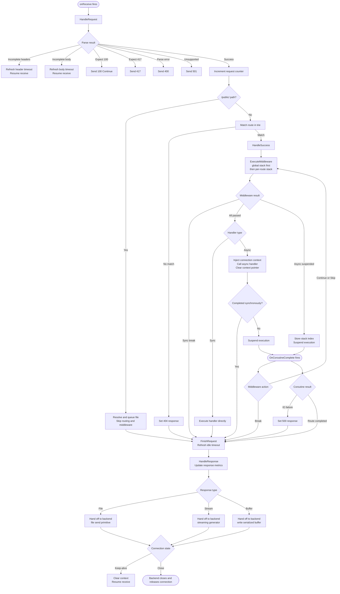
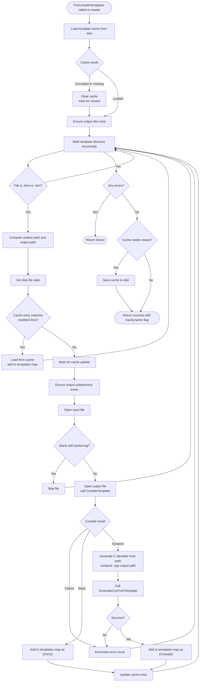
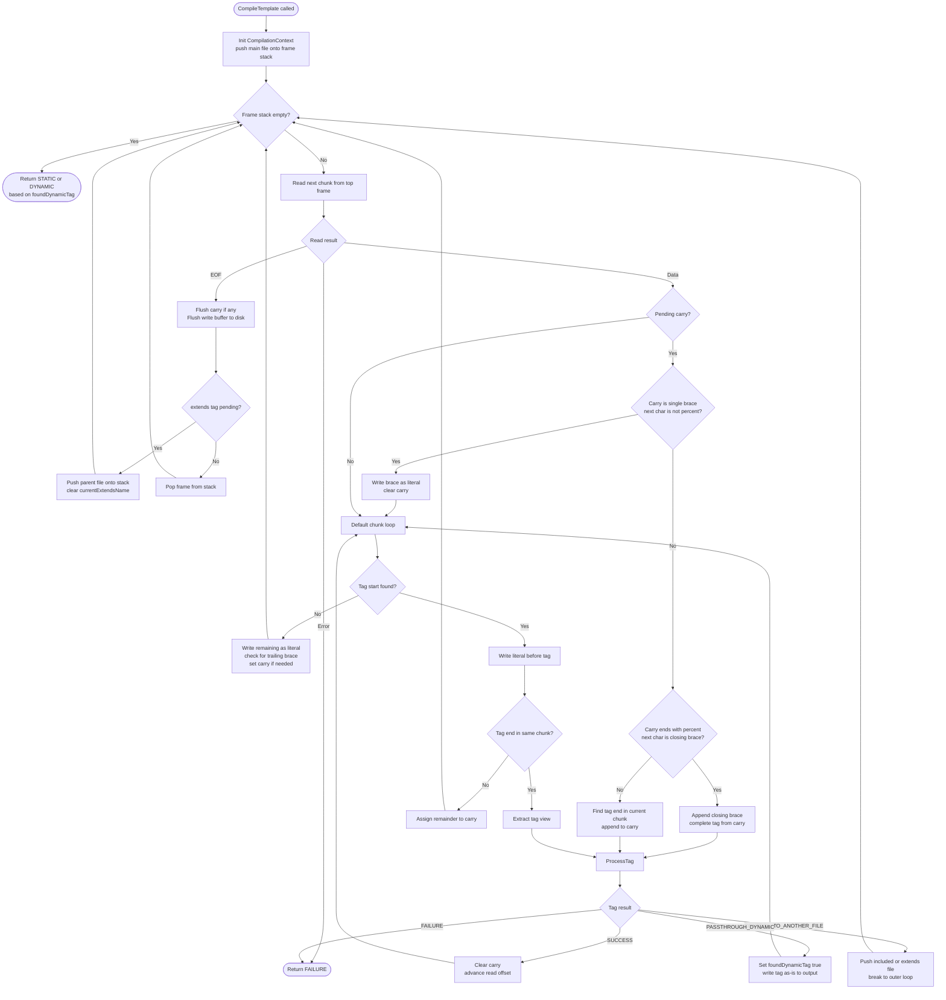
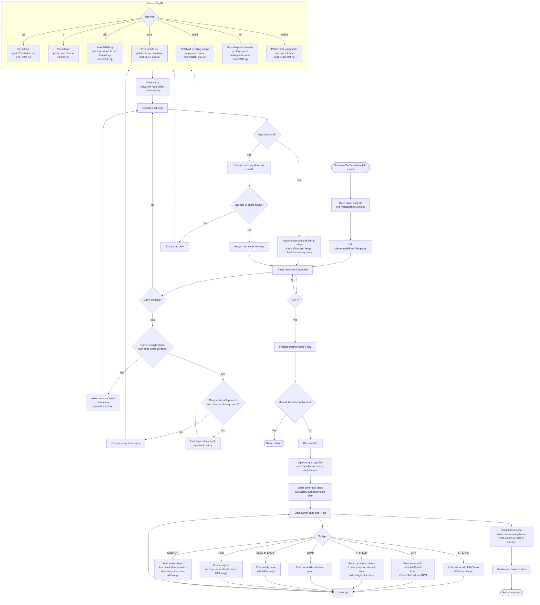

# Architecture

This page describes how WFX initializes and runs at a high level. It does not cover internal implementation details.

---

## Startup flow

```mermaid
flowchart TD
    A([wfx run project]) --> B[SetMinLevel INFO]
    B --> C[CheckAlreadyRunning]

    C --> D{PID file result}
    D -- Not found --> G
    D -- IO error --> E([Fatal: cannot read PID file])
    D -- Corrupted --> F[Delete corrupted PID file]
    F --> G
    D -- OK and alive --> H([Fatal: already running])
    D -- OK but dead --> I[Delete stale PID file]
    I --> G

    G[Validate project directory exists] --> K[Create default_logs and crash_logs dir if missing]
    K --> N[Load wfx.toml and .env\nrequire owner uid and perms 600]

    N --> O[Install SIGINT and SIGTERM handlers]
    O --> P[Install SIGCHLD handler\nwakes master from nanosleep]
    P --> Q[GenerateSSLKey]
    Q --> R[MetricTracer Create\nallocate shared mmap for N workers]

    R --> S[HandleBuildDirectory]
    S --> T[PreCompileTemplates]
    T --> U{hasDynamic?}
    U -- No --> V[Compile source only]
    U -- Yes --> W[Compile source and templates]
    V --> X[LoadDynamicTemplatesFromLib]
    W --> X

    X --> Y{Daemon mode flag set?}
    Y -- Yes --> Z[fork]
    Z --> ZA[Parent logs daemon pid\nexits immediately]
    Z --> ZB[Child calls setsid\nbecomes session leader]
    ZB --> ZC[Redirect stdin stdout stderr\nto dev/null]
    ZC --> ZD
    Y -- No --> ZD[Write PID file via DaemonRegistry]

    ZD --> ZH[Configure logger settings]
    ZH --> ZI[Open master.log if file logging enabled]

    ZI --> ZK[workerPids resize to N slots\nSpawnWorker 0 to N-1]

    subgraph SW[SpawnWorker per slot]
        direction TB
        S1[fork]
        S1 --> S2{pid == 0?\nchild}
        S2 -- Yes --> S3[setpgid\nfirst worker becomes group leader\nrest join group]
        S3 --> S4[MetricTracer InitWorker slot]
        S4 --> S5[CrashTracer SetWorkerName\nCrashTracer Install]
        S5 --> S6[Open worker-N.log if file logging enabled]
        S6 --> S7[Init BufferPool and FileCache]
        S7 --> S8[Construct CoreEngine\nload user library\nregister routes\nload middleware]
        S8 --> S9[Install SIGTERM SIGINT SIG_IGN\nSIGPIPE SIG_IGN SIGHUP SIG_IGN]
        S9 --> S10[PinWorkerToCPU if flag set]
        S10 --> S11([engine.Listen\nenter event loop])
        S2 -- No master --> S12[setpgid on child\nstore pid in workerPids slot\nupdate slot self.pid and startedAt]
    end

    ZK --> SW
    ZK --> ML

    subgraph ML[Master wait loop]
        direction TB
        M1[nanosleep masterPollInterval\nwakes early on SIGCHLD]
        M1 --> M2[ReapDeadWorkers\nwaitpid WNOHANG loop\nincrement crashes\ncompute backoff\nmark SLOT_PENDING or SLOT_DEAD]
        M2 --> M3[RevivePendingWorkers\ncheck nextRetryAt per slot\nSpawnWorker if window expired\nincrement restarts and backoffAttempts]
        M3 --> M4[PollWorkerMetrics\nopen /proc/pid/status per live slot\nparse VmRSS and VmSize\nwrite rssBytes and vmBytes into slot]
        M4 --> M1
    end

    ML --> SD{shouldStop set\nby SIGINT or SIGTERM}
    SD --> SE[Re-enable stdout\nSetMinLevel INFO]
    SE --> SF[For each live slot\nsend SIGTERM]
    SF --> SG[Poll waitpid WNOHANG every 100ms\nup to workerShutdownTimeout]
    SG --> SH{Exited in time?}
    SH -- No --> SI[Send SIGKILL\nwaitpid to reap zombie]
    SH -- Yes --> SJ
    SI --> SJ[MetricTracer Destroy\nmunmap shared region]
    SJ --> SK[DaemonRegistry Delete PID file]
    SK --> SL([Exit 0])
```

---

## Request flow

---

## Template Flow

### Template compilation pipeline

### Compilation loop

### Transpilation loop

---

## Key points

- The master process never handles requests. It only initializes shared state and spawns workers.
- Each worker is fully independent. A crash in one worker does not affect others.
- User code runs inside a loaded shared library. It communicates with the engine through ABI-stable function pointer structs.
- All memory for connections and buffers comes from a per-worker pool, not the system allocator.
- Metrics are written to a shared region. Any worker can aggregate across all slots at any time.
- Per-worker subsystems (buffer pool, file cache, crash tracer) are initialized after spawn and are never shared.