# Architecture

This page describes how WFX initializes and runs at a high level. It does not cover internal implementation details.

---

## Startup flow

```mermaid
flowchart TD
    A([wfx run project]) --> B[SetMinLevel INFO]
    B --> C[CheckAlreadyRunning]

    C --> D{PID file result}
    D -- Not found --> G
    D -- IO error --> E([Fatal: cannot read PID file])
    D -- Corrupted --> F[Delete corrupted PID file]
    F --> G
    D -- OK and alive --> H([Fatal: already running])
    D -- OK but dead --> I[Delete stale PID file]
    I --> G

    G[Validate project directory exists] --> K[Create default_logs and crash_logs dir if missing]
    K --> N[Load the selected config/wfx toml and .env\nrequire owner uid and perms 600]

    N --> O[Install SIGINT and SIGTERM handlers\nroutes to HandleMasterSignal]
    O --> P[Install SIGCHLD handler\nwakes master from nanosleep, does nothing else]
    P --> Q[GenerateSSLKey]
    Q --> R[MetricTracer Create\nallocate shared mmap for N workers]

    R --> PA{Prebuilt boot requested?}
    PA -- Yes --> PB{build/user_entry.so exists?}
    PB -- No --> PC([Fatal: prebuilt library missing])
    PB -- Yes --> PD[LoadTemplatesFromCache\nrestore map from the shipped cache]
    PD --> X

    PA -- No --> S[HandleBuildDirectory]
    S --> T[PreCompileTemplates]
    T --> U{Compile succeeded\nAND has a dynamic template?}
    U -- No: either failed\nor purely static --> V[Compile source only\ntarget: user_entry]
    U -- Yes --> W[Compile source and templates\nboth cmake targets]
    V --> X[LoadDynamicTemplatesFromLib]
    W --> X

    X --> Y{Daemon mode flag set?}
    Y -- Yes --> Z[fork]
    Z --> ZA[Parent logs daemon pid\nexits immediately]
    Z --> ZB[Child calls setsid\nbecomes session leader]
    ZB --> ZC[Redirect stdin stdout stderr\nto dev/null]
    ZC --> ZD
    Y -- No --> ZD[Write PID file via DaemonRegistry]

    ZD --> ZH[Apply configured logger settings\nmin level, stdout, colors, timestamps]
    ZH --> ZI[Open master.log if file logging enabled]

    ZI --> ZK[workerPids resize to N slots\nSpawnWorker 0 to N-1]

    subgraph SW[SpawnWorker per slot]
        direction TB
        S1[fork]
        S1 --> S2{pid == 0?\nchild}
        S2 -- Yes --> S3[setpgid\nfirst worker becomes group leader\nrest join group]
        S3 --> S4[MetricTracer InitWorker slot]
        S4 --> S5[CrashTracer SetWorkerName\nCrashTracer Install]
        S5 --> S6[Open worker-N.log if file logging enabled]
        S6 --> S7[Init BufferPool and FileCache]
        S7 --> S9[Install SIGTERM handler\nSIGINT SIGPIPE SIGHUP ignored]
        S9 --> S10[PinWorkerToCPU if flag set]
        S10 --> S8[Construct CoreEngine:\ncreate connection backend init API tables\ndlopen user .so invoke RegisterMasterAPI\nload middleware]
        S8 --> S11([engine.Listen\nenter event loop, blocks here])
        S2 -- No: master --> S12[setpgid on child\nstore pid in workerPids slot\nupdate slot self.pid and startedAt]
    end

    ZK --> SW
    ZK --> ML

    subgraph ML[Master wait loop]
        direction TB
        M1[nanosleep masterPollInterval\nwakes early on any signal, incl. SIGCHLD]
        M1 --> M2[ReapDeadWorkers\nwaitpid WNOHANG loop\nincrement crashes\ncompute backoff\nmark SLOT_PENDING or SLOT_DEAD]
        M2 --> M3[RevivePendingWorkers\ncheck nextRetryAt per slot\nSpawnWorker if window expired\nincrement restarts and backoffAttempts]
        M3 --> M4[PollWorkerMetrics\nopen /proc/pid/status per live slot\nparse VmRSS and VmSize\nwrite rssBytes and vmBytes into slot]
        M4 --> M1
    end

    ML --> SD{shouldStop set?}
    SD -- Yes --> SF[Log: waiting for workers to shutdown]

    SF --> SG[All workers together: poll waitpid WNOHANG every 100ms\nup to workerShutdownTimeout, shared across every worker]
    SG --> SH{All exited in time?}
    SH -- No --> SI[SIGKILL whatever's left\nwaitpid to reap each zombie]
    SH -- Yes --> SJ
    SI --> SJ[MetricTracer Destroy\nmunmap shared region]
    SJ --> SK[DaemonRegistry Delete PID file]
    SK --> SL([Exit 0])
```

`shouldStop` only ever flips to true because `HandleMasterSignal` ran. That
handler fires asynchronously the instant `SIGINT`/`SIGTERM` arrives, and does
two things at once: it sets `shouldStop`, and it immediately broadcasts
`SIGTERM` to the entire worker process group. That broadcast, not any step in
the diagram above, is what actually asks workers to stop, the wait loop below
it only polls for them to have exited.

The wait loop polls every worker in the same `workerShutdownTimeout` window
at once, not one worker's full timeout after another. A worker that ignores
`SIGTERM`, or one that was spawned by a revival right before the signal
arrived and so never received it, still gets caught by this same shared
deadline, SIGKILLed, and reaped before the master proceeds. No worker
outlives its master. This also keeps the master's own worst-case shutdown
time bounded by `workerShutdownTimeout` regardless of worker count, which
matters because `wfx control stop` gives up and force-kills the master
itself if it waits past that same budget, see [Engine Commands](../core_concepts/engine_commands.md#wfx-control).

---

## Request flow

### Parsing and routing

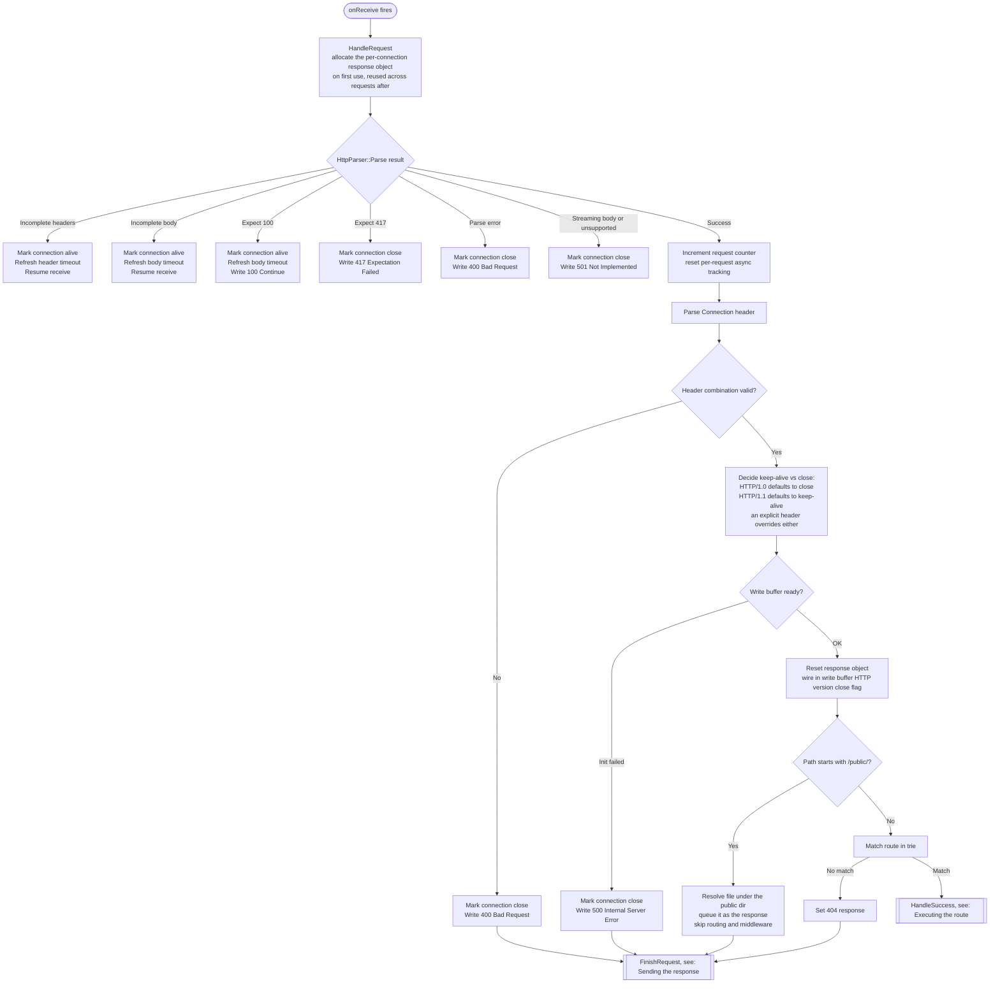

A header combination like `close` and `keep-alive` together is invalid and
takes the same 400 path as any other malformed header.

### Executing the route

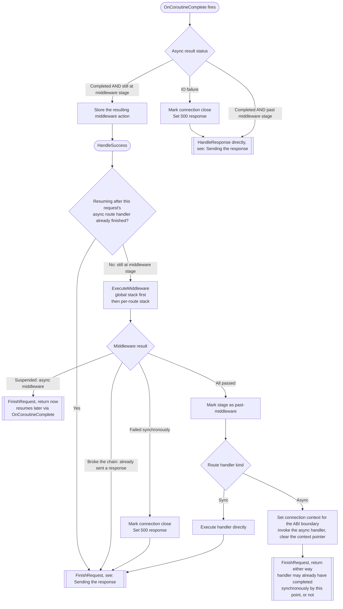

`OnCoroutineComplete`'s two exits are worth noticing: one goes back into
`HandleSuccess` (an async middleware resuming), the other skips straight to
`HandleResponse`, not through `FinishRequest` again, since `FinishRequest`
already ran once, synchronously, right when the handler was first dispatched.

### Sending the response

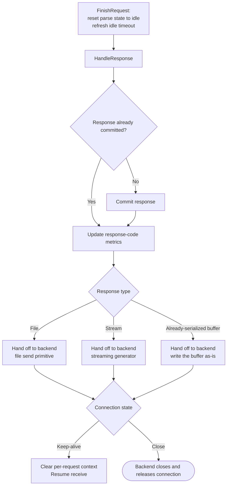

Every path in the two diagrams above that reaches `FinishRequest` lands at
the top of this one. The one exception is `OnCoroutineComplete` calling
`HandleResponse` directly, which just enters this diagram one node lower,
skipping `FinishRequest` for the reason noted above.

---

## Template Flow

### Template compilation pipeline

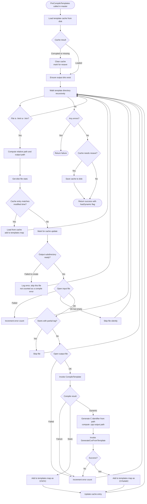

### Restoring templates without compiling

`LoadTemplatesFromCache` is the `--use-prebuilt` counterpart to the pipeline above. The templates map
is what `LoadDynamicTemplatesFromLib` and `GetTemplate` resolve against, so it still has to be
populated even when nothing is being built.

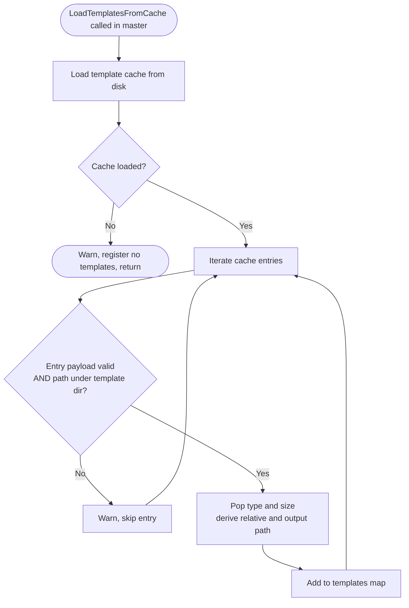

The cache file is the only input, so the template directory is left untouched and can be absent
entirely. Timestamps play no part on this path.

### Compilation loop

#### Reading each frame

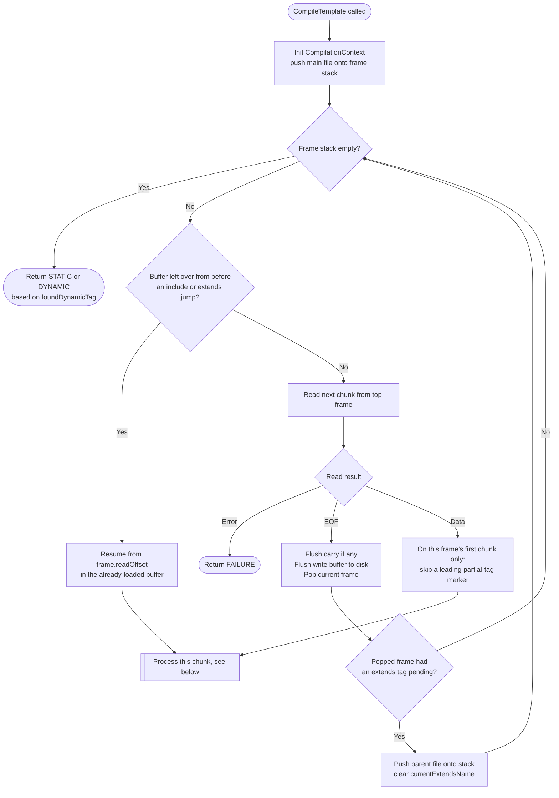

#### Processing one chunk

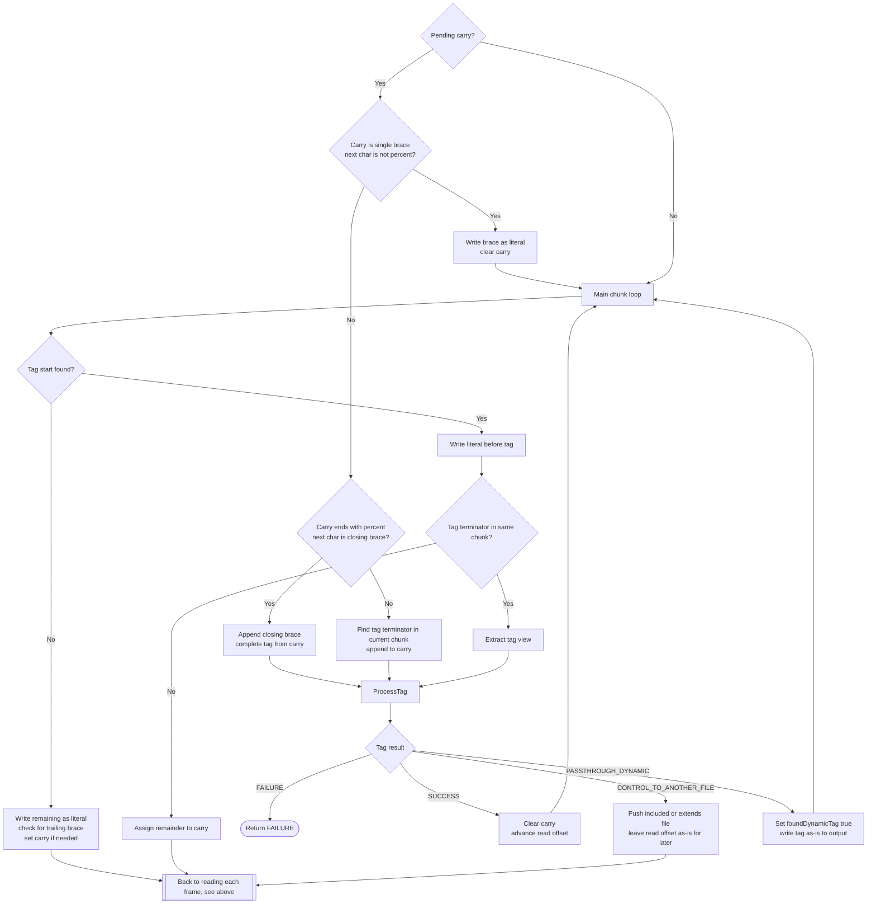

`Pending Carry` is reached from either path in the diagram above: resuming a buffer left
over from an include or extends jump, or a freshly read chunk (after skipping
a leading partial-tag marker on a frame's very first chunk).

### Transpilation loop

This stage works on a single flat, already-fully-resolved HTML file. Unlike the
compilation loop above, there is no frame stack here, ``,
``, and `` are already fully resolved by the earlier
static compile pass, this stage only ever sees `var`, `if`, `elif`, `else`,
`endif`, `for`, and `endfor`.

`GenerateCxxFromTemplate` is a thin wrapper around two functions: `GenerateIRFromTemplate` builds an intermediate representation from the template, then `GenerateCxxFromIR` turns that IR into a generated `.cpp` file.

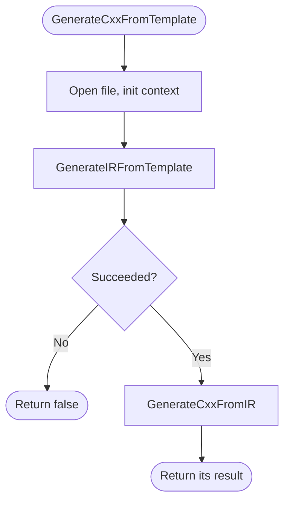

#### Building the IR: GenerateIRFromTemplate

Reads the file in chunks, same carry-over idea as the compilation loop for a
tag split across a chunk boundary, but with no `MAX_TAG_LENGTH` cap here (that
only exists in the earlier static pass), and no file stack, since there is
nothing left to include or extend. Tag dispatch itself is broken out below.

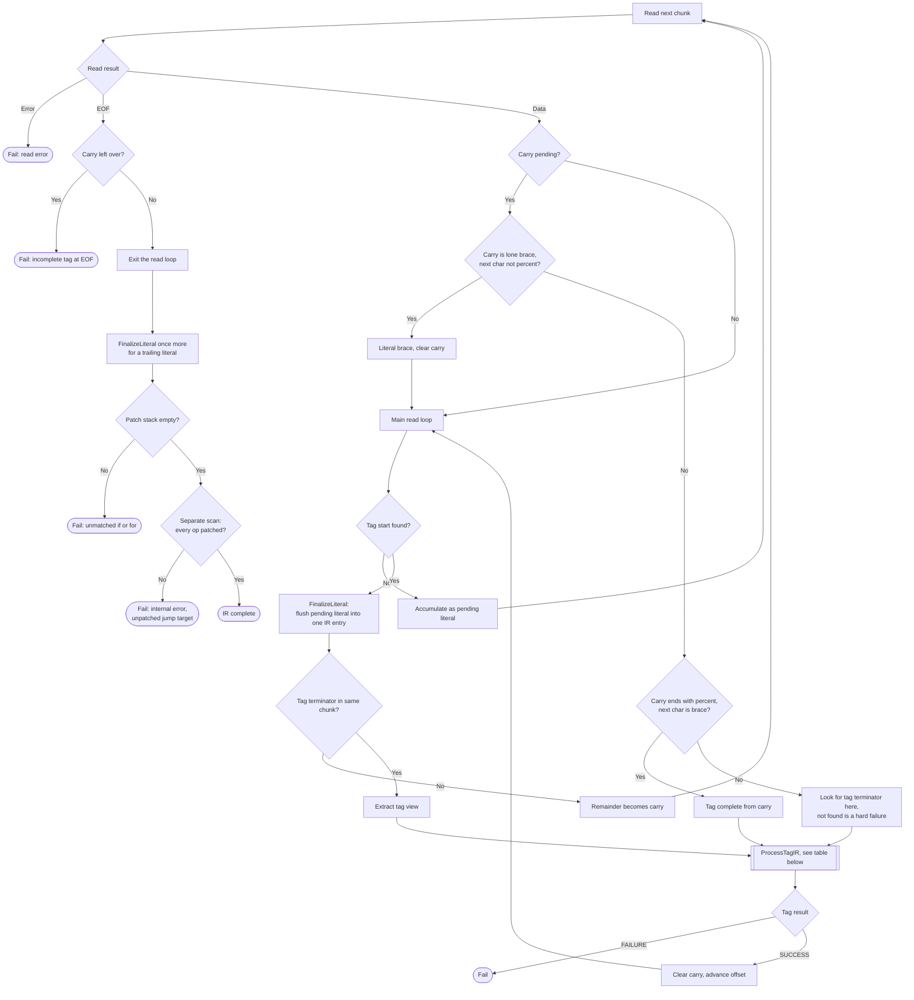

#### Tag dispatch: ProcessTagIR

| Tag | What it does |
|-----|--------------|
| `var` | `ParseExpr`, pool the RPN bytecode, emit `VAR` (payload is the expr index, never needs patching) |
| `if` | `ParseExpr`, push a new patch frame holding just this `IF`'s own index, emit `IF` |
| `elif` | Requires a non-empty stack and frame. Emit `JUMP`, patch only the `IF`/`ELIF` entries currently in the frame to jump here (queued `JUMP`s are left alone, they wait for `endif`). `ParseExpr`, emit `ELIF`, push its index too |
| `else` | Same guard and patch rule as `elif`. Emit `JUMP`, then a bare `ELSE` marker with no payload |
| `endif` | Requires a non-empty stack. Patch `IF`/`ELIF` entries' condition target and `JUMP` entries' plain target, both to this end state. Pop the frame, emit `ENDIF` |
| `for` | Hand-parsed as `identifier in <expr>`. Push a new patch frame holding only this `FOR`'s own index, emit `FOR` |
| `endfor` | Requires a non-empty stack. A `FOR`'s frame only ever holds its own single index. Patch that jump target to this end state, pop the frame, emit `ENDFOR` carrying a copy of the now-patched value |
| anything else | `include`/`extends`/`block` never reach this stage at all, so this is always an unknown tag, fails |

#### Generating the output: GenerateCxxFromIR

The generated `GetState(state, ctx)` method is a `while(true)` wrapped around
a `switch(state)`. Only `LITERAL`, `VAR`, and the trailing default case
actually `return`, every other op sets `state` and `continue`s (or, for
`ELSE`/`ENDIF`, is a genuinely empty case relying on plain C++ fallthrough),
so several IR states can be walked through inside one call without ever
returning to the caller.

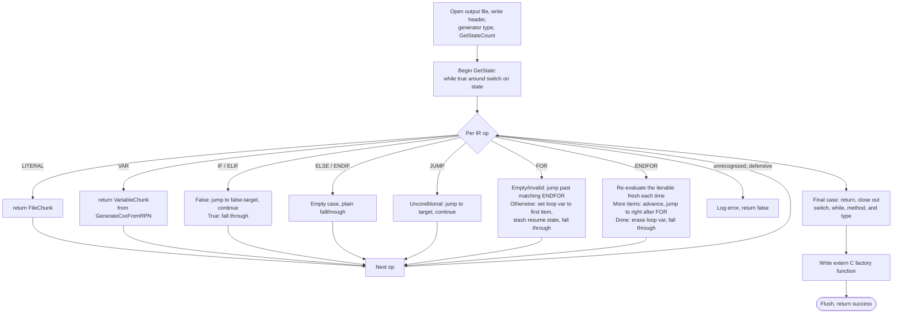

The footer and factory-function writes are the only two writes in this
function that aren't error-checked, everything before them returns `false` on
a write failure.

---

## Key points

- The master process never handles requests. It only initializes shared state and spawns workers.
- Each worker is fully independent. A crash in one worker does not affect others.
- User code runs inside a loaded shared library. It communicates with the engine through ABI-stable function pointer structs.
- All memory for connections and buffers comes from a per-worker pool, not the system allocator.
- Metrics are written to a shared region. Any worker can aggregate across all slots at any time.
- Per-worker subsystems (buffer pool, file cache, crash tracer) are initialized after spawn and are never shared.